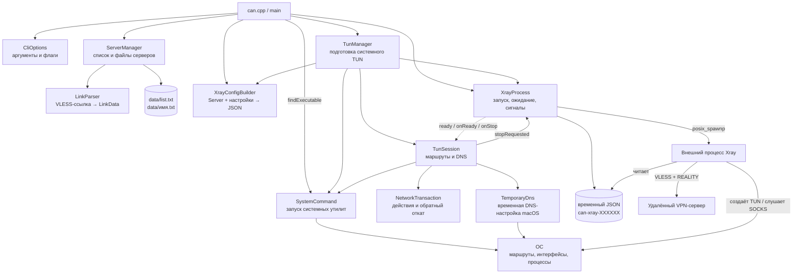
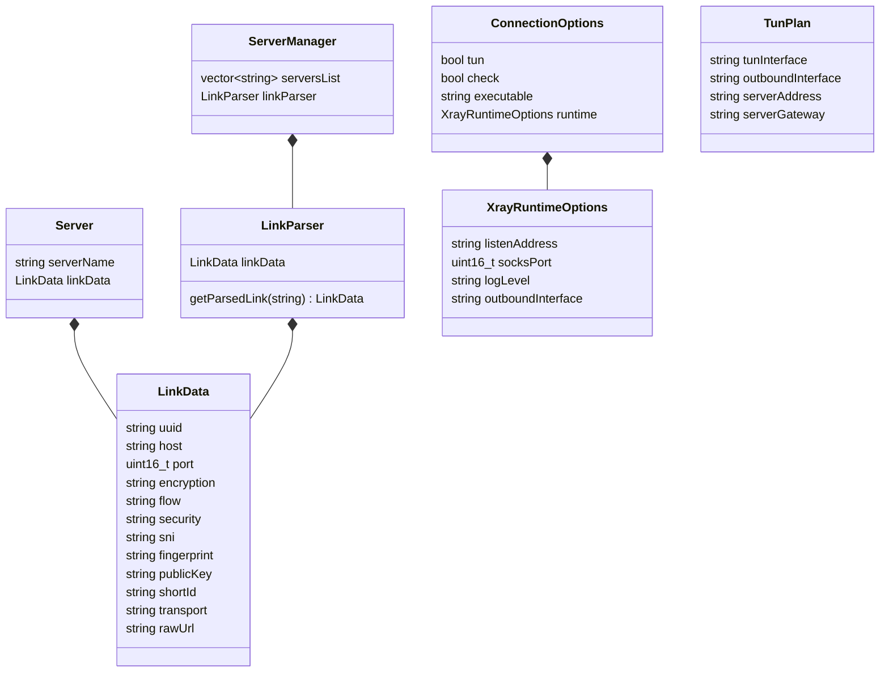
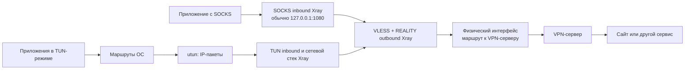
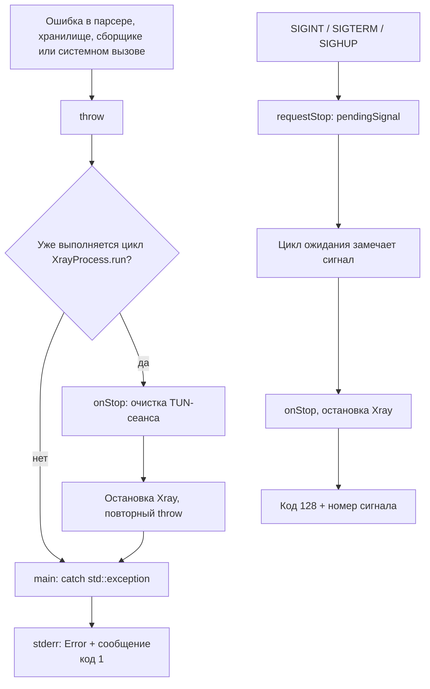
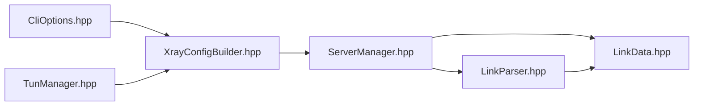
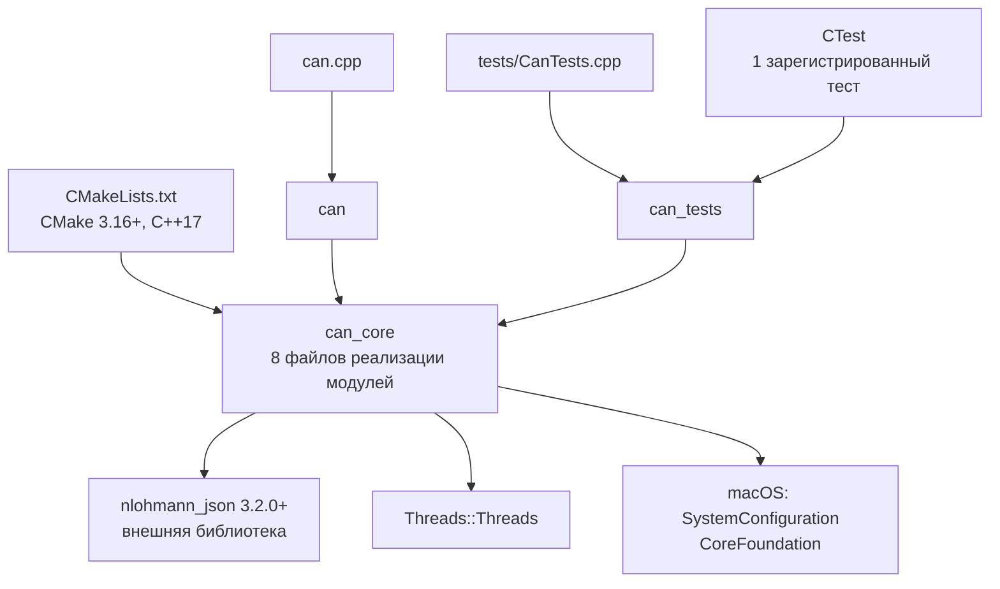

# Карта программы Can

Снимок текущей реализации на 7 сентября 2026 года, после добавления отдельного маршрута к VPN-серверу. Это описание существующего кода; предложения по изменениям вынесены в последний раздел.

Can управляет списком серверов, собирает конфигурацию, запускает Xray и настраивает сеть macOS. Пакеты, VLESS, REALITY, SOCKS и сетевой стек TUN обрабатывает отдельный процесс Xray.

## Короткий разбор: что происходит при запуске

Этот раздел сверён с кодом 8 сентября 2026 года. Начни с него, а подробную карту ниже используй как справочник.

### Общий вход

Любая команда начинается в `main` из [can.cpp](can.cpp). Например, в `./build/can connect 1 --tun` программа получает команду `connect`, номер профиля `1` и флаг `--tun`.

`main` выбирает нужную ветку. `parseServerNumber` проверяет номер, `parseConnectionOptions` разбирает флаги и переменные окружения. При обычной ошибке исключение доходит до `catch` в `main`, который печатает `Error: ...` и возвращает код 1.

### Команды без подключения

В таблице команды сокращены: перед ними подразумевается `./build/can`.

| Запуск | Что вызывается и происходит |
|---|---|
| Без аргументов, `help`, `--help` | `main → printUsage`: печать справки и выход |
| `add NAME URL` | `addServer` проверяет имя; через `LinkParser.getParsedLink` разбирает ссылку; `loadList` читает список; после проверки дубликатов ссылка записывается в `data/NAME.txt`, имя добавляется в список через `saveList` |
| `list` | `listServers → loadList`: читает имена из `data/list.txt`, печатает с номерами |
| `show 1` | `getServer → loadList`: находит имя, читает ссылку из файла, вызывает парсер и возвращает `Server`; `main` печатает его поля |
| `delete 1` | `deleteServer → loadList`: удаляет файл профиля, убирает имя через `vector.erase`, сохраняет список. Следующие номера сдвигаются |
| `config 1` | `getServer → XrayConfigBuilder.build`: собирает JSON для SOCKS и печатает его. Xray не запускается |
| `config 1 --tun --interface en0` | Вместо `build` вызывается `buildTun`: печатает JSON для TUN с именем `utun100`, но не создаёт интерфейс или маршруты |

`loadList` создаёт пустой список и каталог, если их нет. Профиль содержит исходную ссылку; при `show`, `config` и `connect` она разбирается заново. Команда `add` сохраняет профиль, а не открывает VPN-соединение.

### `connect 1`: локальный SOCKS

1. `main` разбирает настройки, получает `Server` через `getServer` и находит исполняемый файл через `findExecutable`.
2. Если интерфейс не указан, `socksOutboundInterface` при необходимости выбирает физический выход. `XrayConfigBuilder.build` создаёт JSON: принимать SOCKS на `127.0.0.1:1080`, отправлять через VLESS + REALITY на выбранный сервер.
3. `requireFreeSocksPort` проверяет порт. `XrayProcess.run` записывает временный JSON и через `posix_spawnp` запускает отдельную программу: `xray run -format=json -c FILE`.
4. Xray слушает SOCKS. Can остаётся запущенным и ждёт завершения Xray или сигнала. Приложение должно само обратиться к SOCKS, например через `curl --proxy socks5h://127.0.0.1:1080 ...`.

`127.0.0.1` означает этот же компьютер, `1080` — порт, на котором Xray принимает обращения. Сам запуск слушателя ещё не доказывает связь с VPN-сервером: Xray создаёт соединения к нему по мере поступления запросов.

### `connect 1 --tun --check`: проверка подготовки

`main → getServer → findExecutable → TunManager.inspect → buildTun`. Проверяются текущие маршруты, выбираются физический интерфейс, шлюз и свободное имя TUN, определяется IPv4 сервера, проверяется возможность собрать JSON. Затем программа печатает результат и выходит. Настоящее подключение к VPN-серверу эта команда не проверяет.

### `sudo ./build/can connect 1 --tun`: системный режим

1. После чтения профиля `main` вызывает `TunManager.run`. Он проверяет права, через `inspect` определяет интерфейс и шлюз, IPv4 сервера и свободное имя вроде `utun100`. `SessionLock` не даёт двум TUN-сеансам Can работать одновременно.
2. `buildTun` собирает JSON с TUN-входом. Менеджер добавляет служебный SOCKS-вход на отдельном порту для проверки связи и вызывает `XrayProcess.run`.
3. `XrayProcess` запускает Xray из временного JSON. Уже сам Xray создаёт `utun100`. Can ждёт появления готового интерфейса.
4. Через `TunSession.activate` Can проверяет VPN запросом через служебный SOCKS. Затем назначает IPv6-адрес TUN, добавляет отдельный маршрут к VPN-серверу через физический шлюз и общие маршруты через TUN.
5. `TemporaryDns.start` задаёт временные DNS-серверы. После этого Can печатает `TUN active` и продолжает наблюдать за процессом Xray. Интернет-трафик, выбранный маршрутами ОС, поступает в Xray через TUN.

`XrayProcessHooks` связывает ожидание процесса с настройкой сети: `ready` проверяет появление интерфейса, `onReady` вызывает `activate`, `onStop` вызывает `stop`. Это обычные переданные функции. Поэтому `XrayProcess` может управлять процессом, не зная деталей DNS и маршрутов.

В текущем коде проверка через служебный SOCKS выполняется до переключения маршрутов. Автоматической проверки связи через уже настроенный системный TUN пока нет.

### Что делают флаги и остановка

- `--xray PATH` выбирает файл программы Xray; сетевой режим не меняет.
- `--interface en0` задаёт физический выход Xray к серверу. Имя интерфейса зависит от компьютера.
- `--port 1081` меняет локальный SOCKS-порт; с `--tun` этот флаг запрещён.
- `sudo` даёт права для настройки TUN и маршрутов; само по себе подключение не создаёт.

При `Ctrl+C` обработчик сигнала отмечает запрос остановки. Цикл `XrayProcess.run` замечает его и вызывает `onStop`: `TunSession.stop` сбрасывает временную DNS-настройку, а `NetworkTransaction.rollback` удаляет добавленные маршруты в обратном порядке. Затем Can останавливает Xray, удаляет временный JSON и завершает работу. В обычном SOCKS-режиме этапа очистки маршрутов/DNS нет. Это порядок штатной остановки; принудительный `SIGKILL` самого Can его не выполняет.

## Сетевая часть простыми словами

### Кто за что отвечает

| Участник | Его работа |
|---|---|
| Can | Читает профиль, составляет инструкцию JSON, запускает Xray и настраивает маршруты/DNS |
| Xray на компьютере | Принимает трафик от приложений и передаёт его через защищённые соединения к серверу |
| TUN (`utun100`) | Виртуальный сетевой интерфейс: ОС передаёт ему IP-пакеты, а Xray читает их |
| Физический интерфейс (`en0` в твоих тестах) | Реально отправляет данные в сеть, например через Wi-Fi |
| Удалённый VPN-сервер | Принимает соединения Xray и обращается к нужным сайтам/сервисам от своего имени |

JSON — инструкция для Xray. `inbounds` описывают, откуда принимать трафик: SOCKS или TUN. `outbounds` описывают, куда и как его отправлять: адрес сервера, порт, VLESS и параметры REALITY. `XrayConfigBuilder` только собирает эту инструкцию; обработку трафика реализует ядро Xray.

### Что такое пакеты, маршруты и DNS

Пакет — порция данных с адресной информацией. IP указывает узел сети, порт помогает выбрать службу на этом узле. TCP и UDP — способы передачи данных поверх IP. DNS узнаёт IP по имени сайта. Таблица маршрутов ОС определяет, через какой интерфейс и шлюз отправить пакет.

Обычно путь такой:

```text
Приложение → ОС → Wi-Fi → интернет → сайт
```

При SOCKS приложение явно просит Xray связаться с нужным сайтом:

```text
Приложение → SOCKS на 127.0.0.1 → Xray → Wi-Fi → VPN-сервер → сайт
```

При TUN приложение работает обычным образом, но ОС направляет его пакеты в виртуальный интерфейс:

```text
Приложение → маршруты ОС → utun100 → Xray → Wi-Fi → VPN-сервер → сайт
```

В Xray встроен сетевой стек, который разбирает IP-пакеты из TUN и обслуживает TCP/UDP. Затем их данные передаются по VLESS; защита соединения в нашем профиле обеспечивается REALITY. На обратном пути Xray получает ответы и формирует пакеты для ОС через TUN. Приложение получает ответ через свой обычный сетевой сокет.

Например, Safari открывает сайт: DNS узнаёт его IP, браузер начинает соединение, ОС направляет его пакеты в TUN, Xray передаёт запрос серверу, сервер соединяется с сайтом. Ответ возвращается через сервер и Xray в Safari. Обычные DNS-запросы к настроенным `1.1.1.1` и `9.9.9.9` тоже направляются в TUN отдельными маршрутами. В режиме `socks5h` curl передаёт имя назначения прокси, поэтому локальное разрешение имени сайта ему не требуется.

### Почему пришлось добавить исключение для сервера

Для одной операции есть два разных назначения: приложение хочет связаться с сайтом, а Xray для этого должен связаться с VPN-сервером.

```text
Пакеты приложений к интернету → TUN
Соединение Xray с VPN-сервером → физический шлюз
```

Без исключения маршрут к самому VPN-серверу попадал в TUN, а доступного маршрута с привязкой к `en0` не было. Теперь `addServerRoute` добавляет более точное правило для IP сервера, которое имеет приоритет над общими правилами `/1`. Физический интернет при включении TUN по-прежнему нужен: через него Xray связывается с сервером.

Can во время передачи данных в основном ждёт события процесса. Наш C++-код не обрабатывает каждый пакет и не реализует REALITY самостоятельно. Вся связка получилась из запуска готового ядра Xray, его JSON-конфигурации и настройки сетевых маршрутов ОС.

## 1. Общая карта модулей

Стрелка означает «вызывает или использует». Пунктир показывает обратный вызов через функцию, переданную в `XrayProcessHooks`, а не прямую зависимость XrayProcess от TunManager.



`TunSession` и `TemporaryDns` — внутренние классы из `TunManager.cpp`. Отдельных файлов с такими именами нет. `SystemCommand` и `CliOptions` — модули со свободными функциями, а не классы.

## 2. Что находится в каждом файле

Для модулей с парой `.hpp` / `.cpp` заголовок содержит объявления, файл `.cpp` — реализацию.

| Файл / модуль | Задача и основные точки входа | Кто использует |
|---|---|---|
| [can.cpp](can.cpp) | `main`: выбирает команду, соединяет модули, печатает результат и ошибки | Точка входа программы |
| [CliOptions.hpp](CliOptions.hpp), [CliOptions.cpp](CliOptions.cpp) | `parseServerNumber`, `parseConnectionOptions`, `requireFreeSocksPort`, `printUsage`; внутренняя `positiveNumber` | `main`, тесты |
| [LinkData.hpp](LinkData.hpp) | Структура с разобранными полями VLESS-ссылки и исходной строкой | Парсер, `Server`, сборщик JSON |
| [LinkParser.hpp](LinkParser.hpp), [LinkParser.cpp](LinkParser.cpp) | `getParsedLink`; внутри `checkLink`, `getUuid`, `getHost`, `getPort`, `getParameter` | `ServerManager`, тесты |
| [ServerManager.hpp](ServerManager.hpp), [ServerManager.cpp](ServerManager.cpp) | Структура `Server`; класс с `addServer`, `deleteServer`, `getServer`, `listServers`; загрузка и сохранение списка | `main`, тесты; тип `Server` нужен сборщику и TUN |
| [XrayConfigBuilder.hpp](XrayConfigBuilder.hpp), [XrayConfigBuilder.cpp](XrayConfigBuilder.cpp) | `XrayRuntimeOptions`; `build`, `buildTun`; внутри `validate`, `buildInbound`, `buildOutbound` | `main`, `TunManager`, тесты |
| [XrayProcess.hpp](XrayProcess.hpp), [XrayProcess.cpp](XrayProcess.cpp) | `XrayProcessHooks`; `run`, `stopRequested`; временный JSON, дочерний процесс, сигналы | `main`, `TunManager`, `TunSession`, тесты |
| [TunManager.hpp](TunManager.hpp), [TunManager.cpp](TunManager.cpp) | `TunPlan`; `inspect`, `socksOutboundInterface`, `run`; внутренние классы для TUN-сеанса | `main`; TUN-реализация только для macOS |
| [NetworkTransaction.hpp](NetworkTransaction.hpp), [NetworkTransaction.cpp](NetworkTransaction.cpp) | `apply`, `rollback`, деструктор: хранит действия отмены и выполняет их в обратном порядке | `TunSession`, тесты |
| [SystemCommand.hpp](SystemCommand.hpp), [SystemCommand.cpp](SystemCommand.cpp) | `CommandResult`; `runSystemCommand`, `checkedSystemCommand`, `findExecutable` | `main`, `TunManager.cpp`, тесты |
| [tests/CanTests.cpp](tests/CanTests.cpp) | 21 тестовый сценарий; вспомогательный `fakeXray` имитирует дочерний процесс | CTest |
| [CMakeLists.txt](CMakeLists.txt) | Сборка `can_core`, `can`, `can_tests`; библиотеки и фреймворки | CMake |
| [README.md](README.md) | Инструкция по сборке, командам и режимам | Пользователь |

## 3. Данные и владение объектами



Ромб означает, что объект содержит другой объект по значению. `ServerManager` хранит в векторе только имена серверов. Полный `Server` создаётся при `getServer`, когда ссылка считывается из файла и разбирается заново. `LinkParser` хранит изменяемый рабочий `linkData` внутри себя и возвращает его копию.

`TunPlan` — снимок выбранных сетевых параметров: свободное имя TUN, физический интерфейс, IPv4 сервера и физический шлюз. Он не владеет системным интерфейсом или маршрутами.

### От ссылки до JSON

| Источник | Поле `LinkData` | Куда попадает в outbound JSON |
|---|---|---|
| Часть между `vless://` и `@` | `uuid` | `settings.vnext[0].users[0].id` |
| Адрес после `@` | `host` | `settings.vnext[0].address` |
| Порт после адреса | `port` | `settings.vnext[0].port` |
| `encryption` | `encryption` | `settings.vnext[0].users[0].encryption` |
| `flow` | `flow` | `settings.vnext[0].users[0].flow`, если непустое |
| `security` | `security` | Проверяется; поддерживается `reality` |
| `sni` | `sni` | `streamSettings.realitySettings.serverName` |
| `fp` | `fingerprint` | `streamSettings.realitySettings.fingerprint` |
| `pbk` | `publicKey` | `streamSettings.realitySettings.publicKey` |
| `sid` | `shortId` | `streamSettings.realitySettings.shortId` |
| `type` | `transport` | Принимается `tcp` или `raw`; JSON содержит `network: tcp` |
| Вся строка | `rawUrl` | В JSON не переносится |

Парсер использует значения по умолчанию: `encryption=none`, `flow=""`, `security=none`, `sni=host`, `fp=""`, `pbk=""`, `sid=""`, `type=tcp`. Сборщик заменяет пустой fingerprint на `chrome`. `spiderX` в JSON всегда пустой: параметр `spx` сейчас не разбирается. Фрагмент после `#` не превращается в имя сервера — имя задаётся отдельным аргументом `add`.

При TUN-запуске менеджер заменяет `host` в копии `Server` на заранее разрешённый IPv4. `buildTun` заменяет `xtls-rprx-vision` на `xtls-rprx-vision-udp443` в конфигурации. Сохранённая ссылка при этих преобразованиях не меняется.

### Настройки запуска

| Настройка | Начальное значение | Источник переопределения |
|---|---|---|
| `ConnectionOptions.tun` | `false` | `--tun` |
| `ConnectionOptions.check` | `false` | `--check`, только вместе с `--tun` |
| `executable` | `xray` | `CAN_XRAY_BINARY`, затем `--xray` |
| `outboundInterface` | Пустая строка | `CAN_OUTBOUND_INTERFACE`, затем `--interface`; при подключении возможен автоматический выбор |
| `socksPort` | `1080` | `--port`, только в SOCKS-режиме |
| `listenAddress` | `127.0.0.1` | Сейчас через структуру в коде |
| `logLevel` | `warning` | Сейчас через структуру в коде |

Флаги командной строки имеют приоритет над указанными переменными окружения. Для служебного SOCKS в TUN-режиме выбирается отдельный временный порт. Он остаётся открытым в течение работы Xray, а не только на время проверки.

## 4. Карта команд

| Команда | Основной путь вызовов | Эффект |
|---|---|---|
| `help`, `--help`, без аргументов | `main → printUsage` | Печать справки |
| `add NAME URL` | `addServer → validateServerName → parseLink → getParsedLink → loadList → запись файла → saveList` | Создание профиля |
| `delete N` | `parseServerNumber → deleteServer → loadList → remove → vector.erase → saveList` | Удаление профиля, перенумерация |
| `list` | `listServers → loadList` | Печать списка |
| `show N` | `parseServerNumber → getServer → loadList → чтение первой строки → getParsedLink` | Печать части полей сервера |
| `config N` | `parseConnectionOptions → getServer → build → dump` | Печать SOCKS-конфига, без запуска Xray |
| `config N --tun --interface IFACE` | `parseConnectionOptions → getServer → buildTun` | Печать TUN-конфига с именем `utun100`; сетевое обследование не выполняется |
| `connect N` | `getServer → findExecutable → socksOutboundInterface при необходимости → build → requireFreeSocksPort → XrayProcess.run` | Запуск локального SOCKS |
| `connect N --tun --check` | `getServer → findExecutable → inspect → buildTun` | Проверка подготовки без запуска Xray и изменения сети |
| `connect N --tun` | `getServer → findExecutable → TunManager.run → XrayProcess.run` | Запуск Xray и настройка системной маршрутизации |

Общий путь `loadList`:

```text
loadList
  serversList.clear
  listCreated: is_regular_file(data/list.txt)
  если файла нет: createList → create_directories → ofstream
  чтение строк → удаление завершающего CR → пропуск пустых строк
  validateServerName → serversList.push_back
```

`loadList` может создавать каталог и список даже из команды чтения (`list`, `show`, `config`). Путь `./data` зависит от текущего рабочего каталога процесса, а не от места нахождения бинарника. `getServer` читает только первую строку файла профиля. JSON-кеширования в файлах серверов сейчас нет.

После `delete` дополнительный `resizeList` не нужен: `vector.erase` сдвигает элементы, а отображаемый номер вычисляется как `индекс + 1`. Эти номера не являются постоянными идентификаторами.

## 5. Полный жизненный цикл TUN

```mermaid
sequenceDiagram
    participant M as main
    participant T as TunManager
    participant B as XrayConfigBuilder
    participant P as XrayProcess
    participant X as Xray
    participant S as TunSession
    participant O as macOS

    M->>T: run(Server, options, executable)
    T->>T: root, inspect, SessionLock
    T->>T: IPv4 сервера, шлюз, свободное имя и порт
    T->>B: buildTun + build для health-check inbound
    B-->>T: JSON
    T->>P: run(JSON, hooks, executable)
    P->>P: mkstemp, запись JSON, установка обработчиков сигналов
    P->>X: posix_spawnp: xray run -format=json -c FILE
    X->>O: создать utun, открыть служебный SOCKS
    loop Пока интерфейс не готов, процесс жив и нет сигнала
        P->>S: ready()
        S->>O: getifaddrs: IPv4 и IFF_UP
    end
    P->>S: onReady: activate()
    S->>O: перепроверить физический маршрут
    S->>X: curl через служебный SOCKS к api.ipify.org
    X-->>S: ответ с IPv4
    S->>O: перепроверить сеть, добавить IPv6-адрес TUN
    S->>O: host-маршрут к VPN-серверу через физический шлюз
    S->>O: split-маршруты IPv4 и IPv6, host-маршруты DNS
    S->>O: TemporaryDns.start
    S-->>M: печать TUN active в общий терминал
    Note over P,X: Ожидание завершения Xray или сигнала остановки
    P->>S: onStop: stop()
    S->>O: удалить временную DNS-настройку
    S->>O: откатить добавленные маршруты в обратном порядке
    P->>X: остановить, если ещё работает; waitpid
    Note over X,O: Закрытие TUN-дескриптора освобождает интерфейс
    P->>P: восстановить сигналы, удалить временный JSON
    P-->>T: код завершения
    T-->>M: код завершения, освобождение блокировки
```

Схема показывает штатную остановку. Если Xray сам завершился раньше, `onStop` вызывается уже после обнаружения его завершения. Исключение из `activate` также приводит к очистке и остановке дочернего процесса.

### Внутренние части TunManager.cpp

| Элемент | Ответственность |
|---|---|
| `isTunnel` | Узнаёт имена `utun`, `tun`, `tap`, `ppp`, `ipsec`, `gif` |
| `routeField` | Вынимает именованное поле из текстового вывода `route` |
| `physicalInterface` | Проверяет default и маршруты к двум проверочным IPv4; отклоняет конфликт с другим VPN |
| `physicalGateway` | Читает шлюз из IPv4 default route |
| `ipv4Address` | `getaddrinfo(AF_INET)` и преобразование первого результата в строку |
| `inspect` | Собирает `TunPlan`, ищет свободное имя среди `utun100`–`utun999` |
| `socksOutboundInterface` | В SOCKS-режиме при чужом VPN ищет единственный физический IPv4 default через `netstat` |
| `unusedLoopbackPort` | Временно делает `bind` на порт 0, узнаёт выбранный порт и закрывает сокет |
| `SessionLock` | Удерживает `flock` на `/var/run/can-tun.lock` до конца сеанса |
| `TunSession.ready` / `tunIsReady` | Проверяет существование интерфейса с IPv4 и флагом `IFF_UP` |
| `TunSession.activate` | Проверка связи, IPv6-адрес, маршруты и DNS |
| `TunSession.addServerRoute` | Записывает в транзакцию маршрут к IP сервера через физический шлюз |
| `TunSession.addRoute` | Записывает в транзакцию маршрут через TUN |
| `TunSession.stop` | Сначала сбрасывает DNS, затем откатывает маршруты |
| `TemporaryDns.start/reset` | Добавляет DNS-ключ с временем жизни сессии SystemConfiguration; освобождает сессию |
| `CfHandle` | Освобождает временные объекты CoreFoundation через `CFRelease` |

`NetworkTransaction` не знает синтаксиса `route`, IP-адресов или DNS. Он хранит `Step { name, undo, applied }`. Команды и функции отмены ему передаёт `TunSession`. Неудавшееся действие не считается применённым; неудачная отмена остаётся доступной для повторного отката. Деструктор тоже пытается выполнить откат.

### Маршруты после активации

Порядок важен: исключение для самого VPN-сервера добавляется раньше общего перенаправления.

| Назначение | Направление | Обработчик |
|---|---|---|
| IPv4 VPN-сервера `/32` | Физический шлюз | `addServerRoute` |
| `0.0.0.0/1`, `128.0.0.0/1` | TUN | `addRoute` |
| `::/1`, `8000::/1` | TUN | `addRoute` |
| `1.1.1.1/32`, `9.9.9.9/32` | TUN | `addRoute` |

Более специфичные существующие маршруты, например локальной сети, могут иметь приоритет над `/1`. Таблица описывает добавляемые правила, а не гарантию перехвата любого пакета при любых других настройках ОС.

Служебный IPv6-адрес — `fd73:616e::2/64`, MTU из JSON — 1500. IPv4 TUN назначает Xray; в проведённых запусках это `169.254.10.2`. DNS-серверы текущей реализации — `1.1.1.1` и `9.9.9.9`.

## 6. Как идут пакеты

Здесь стрелки показывают сетевой путь, а не вызовы C++.



Ответы проходят обратный путь. Методы `ServerManager`, `LinkParser`, `XrayConfigBuilder` не вызываются для каждого пакета. `XrayProcess` во время работы наблюдает за дочерним процессом и сигналами; передачу пользовательских данных выполняет Xray.

## 7. Ошибки, процессы и время жизни ресурсов



`XrayProcess` вызывает `posix_spawnp` напрямую. Он не использует `SystemCommand`: Xray — долгоживущий процесс с отдельным жизненным циклом. `SystemCommand` предназначен для коротких утилит, собирает stdout/stderr в строку, имеет общий таймаут 10 секунд и ограничение вывода 1 МиБ. Аргументы передаются без командной оболочки.

В `XrayProcess.cpp`: `TemporaryConfig` удаляет временный JSON; `SpawnAttributes` освобождает атрибуты запуска; `ParentSignalGuard` восстанавливает обработчики сигналов; `ChildProcess` ожидает и останавливает процесс. При остановке после сигнала ожидание занимает до примерно двух секунд, затем возможен `SIGKILL`. Временный JSON создаётся через `mkstemp` с правами 0600.

В `SystemCommand.cpp`: `FileDescriptor` закрывает дескрипторы; `Actions` и `Attributes` освобождают настройки `posix_spawn`. При ошибке чтения или таймауте функция завершает ещё работающую утилиту и ожидает её.

Очистка рассчитана на обычный выход, обработанные исключения и перечисленные сигналы. Принудительный `SIGKILL` самого Can не запускает его деструкторы. Наличие этих механизмов не означает наличие kill switch или восстановления после любого аварийного завершения.

## 8. Прямые зависимости заголовков

Ниже только собственные заголовки проекта; стандартные библиотеки не показаны. Стрелка означает непосредственный `#include`.



`XrayProcess.hpp`, `SystemCommand.hpp`, `NetworkTransaction.hpp` не включают другие собственные заголовки проекта. Каждый `.cpp` включает свой заголовок. Дополнительные прямые включения:

| Файл | Заголовки других модулей |
|---|---|
| `can.cpp` | `ServerManager`, `XrayConfigBuilder`, `XrayProcess`, `CliOptions`, `SystemCommand`, `TunManager` |
| `TunManager.cpp` | `NetworkTransaction`, `SystemCommand`, `XrayProcess` |
| `tests/CanTests.cpp` | `CliOptions`, `LinkParser`, `NetworkTransaction`, `SystemCommand`, `XrayConfigBuilder`, `XrayProcess` |

Поэтому изменение `ServerManager.hpp` затрагивает сборщик JSON, параметры CLI и TUN даже тогда, когда меняется только хранилище. Причина — объявление `Server` в заголовке `ServerManager`. `XrayRuntimeOptions` аналогично связывает CLI и TUN с заголовком сборщика.

## 9. Сборка и внешние зависимости



`can_core` состоит из `ServerManager.cpp`, `LinkParser.cpp`, `XrayConfigBuilder.cpp`, `XrayProcess.cpp`, `CliOptions.cpp`, `SystemCommand.cpp`, `NetworkTransaction.cpp`, `TunManager.cpp`. Xray не собирается и не линкуется в этот target.

| Зависимость при выполнении | Для чего нужна |
|---|---|
| Внешний исполняемый файл Xray | SOCKS, TUN, сетевой стек, VLESS, REALITY |
| `/sbin/route` | Обследование, добавление и удаление маршрутов |
| `/sbin/ifconfig` | Дополнительный IPv6-адрес TUN |
| `/usr/sbin/netstat` | Поиск физического default при активном другом VPN в SOCKS-режиме |
| `/usr/bin/curl` | Проверка связи через служебный SOCKS перед установкой маршрутов |
| `https://api.ipify.org` | Внешняя служба, на ответ которой опирается текущая проверка запуска |
| POSIX API | `spawn`, `waitpid`, сигналы, сокеты, дескрипторы |
| API macOS | DNS-сессия SystemConfiguration и сведения об интерфейсах |
| `./data/list.txt` | Порядок и имена серверов |
| `./data/NAME.txt` | Исходная VLESS-ссылка профиля |
| Временный каталог ОС | `can-xray-XXXXXX` с JSON для процесса Xray |
| `/var/run/can-tun.lock` | Блокировка одновременных TUN-сеансов Can; файл может остаться после освобождения блокировки |

Исполняемый Xray ищется по явному пути либо в `PATH`, затем в `/opt/homebrew/bin`, `/usr/local/bin`, `/usr/bin`. Конфигурация ориентирована на уже проверенную в этой сессии версию 26.3.27; автоматической проверки версии перед запуском нет.

Ветка TUN для macOS находится под `#ifdef __APPLE__`. В другой ОС `inspect` и `run` сообщают, что TUN не реализован; автоматический выбор интерфейса для SOCKS возвращает пустую строку. Остальной код использует POSIX API: поддержки Windows в текущей реализации нет.

## 10. Карта тестов и границы проверки

Один target CTest запускает 21 сценарий из `CanTests.cpp`:

| Область | Сценариев | Что проверяется |
|---|---|---|
| `LinkParser` | 2 | Поля корректной ссылки и некоторые некорректные ссылки/порты |
| `XrayConfigBuilder` | 4 | SOCKS/интерфейс, структура TUN, обязательный интерфейс, неподдерживаемые transport/security |
| CLI и проверка порта | 4 | Номера серверов, флаги/окружение, неправильные флаги, занятый SOCKS-порт |
| `NetworkTransaction` | 3 | Обратный порядок, пропуск неудавшегося действия, повтор отмены после ошибки, откат в деструкторе |
| `SystemCommand` | 2 | Буквальные аргументы без shell, коды возврата и поиск бинарника |
| `XrayProcess` | 5 | Права и удаление конфига, сбой callback, сигналы, обычный выход, выход до readiness |
| `ServerManager` | 1 | Добавление, чтение, дубликаты, имена, удаление и перенумерация |

Тестовый `fakeXray` — режим самого `can_tests`. Он читает переданный JSON и имитирует ожидание либо завершение; он не устанавливает REALITY-соединение и не создаёт настоящий TUN.

Прямых автоматических тестов реального `TunManager.inspect/run`, macOS DNS, команд маршрутизации и внешнего VPN-сервера сейчас нет. Исправление host-маршрута подтверждено ручным запуском пользователя: обычный `curl --noproxy '*'` вернул IP VPN-сервера. Это не заменяет отдельную проверку IPv6, восстановления после аварии и смены сети.

## 11. Где разбирать и дорабатывать завтра

Это точки для анализа, а не изменения, выполненные вместе с картой.

| Задача | Начать отсюда | Наблюдение по текущему коду |
|---|---|---|
| Надёжность подключения и понятный статус | `TunSession.activate`, `XrayProcess.run` | Health check выполняется до установки маршрутов; после неё нет проверки через TUN. `TUN active` не основан на такой проверке |
| Маршрут к серверу и смена сети | `inspect`, `physicalGateway`, `addServerRoute` | Шлюз читается один раз; проверяется только непустое значение. Уже существующий host-маршрут приводит к ошибке добавления. Мониторинга смены интерфейса/шлюза нет |
| Аварийное завершение и восстановление | `NetworkTransaction`, `TunSession.stop`, `ChildProcess` | Есть штатный откат, но нет постоянного журнала для восстановления после убийства Can. Kill switch отсутствует |
| Корректный разбор ссылок | `LinkParser.getHost/getPort/getParameter` | IPv6-адрес сервера в квадратных скобках не разбирается; percent-decoding отсутствует; поиск параметров не ограничен query-частью до `#` |
| Проверки полей профиля | `checkLink`, `validate`, `buildOutbound` | Проверяется наличие ряда полей, но не полная корректность UUID/ключа/shortId. Профиль может добавиться, а позже быть отвергнут сборщиком или Xray |
| Надёжность хранилища | `addServer`, `deleteServer`, `saveList` | Файл профиля и список изменяются раздельно. Ошибка между этими операциями оставляет несогласованность; список переписывается с truncation |
| Независимость от текущего каталога | `LIST_PATH`, пути в `ServerManager` | Запуск из другого каталога обращается к другому `./data` |
| Уменьшение зависимостей заголовков | `ServerManager.hpp`, `XrayConfigBuilder.hpp` | Возможные отдельные заголовки для `Server` и настроек запуска уменьшат связь CLI/сборщика с менеджером данных |
| Разделение ответственности | `TunManager.cpp` | Обследование сети, DNS, маршруты, проверка связи и управление сеансом находятся в одном файле |
| Разделение данных и вывода | `ServerManager.listServers`, `main` | Менеджер данных сам печатает список, а остальные результаты форматирует `main` |
| Диагностика и таймауты | `XrayRuntimeOptions`, `CliOptions`, `SystemCommand` | Нет CLI-флага log level; проверка зависит от одной внешней службы. Её curl-таймауты дополнительно ограничены таймаутом SystemCommand |
| Выбор портов и параллельные запуски | `requireFreeSocksPort`, `unusedLoopbackPort` | Проверочный сокет закрывается до запуска Xray: порт может занять другой процесс |
| Поддержка других ОС | `TunManager` и POSIX-слой | Для Linux нужен отдельный backend TUN/маршрутов/DNS; для Windows также другой слой запуска процессов и сигналов |
| Поддержка других транспортов | `LinkData`, `LinkParser`, `buildOutbound` | Сейчас сборщик поддерживает только VLESS + TCP/raw + REALITY |
| Регрессионные проверки сети | `tests/CanTests.cpp`, `TunManager` | Полезно отделить построение плана маршрутов от его выполнения и проверять порядок исключения сервера, отката и обработку конфликтов |

Удобный порядок чтения: `can.cpp` → структуры данных → `LinkParser` → `ServerManager` → `XrayConfigBuilder` → `XrayProcess` → `TunManager` вместе с `NetworkTransaction` и `SystemCommand` → тесты.
