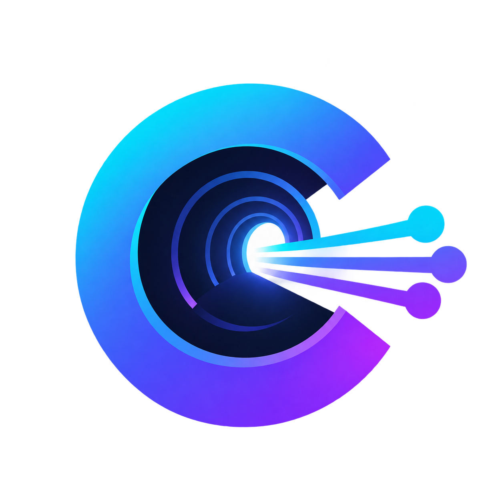

<p align="center">
  
</p>

<h1 align="center">Can</h1>

<p align="center">A small, safety-focused VLESS + REALITY client for Xray.</p>
<p align="center"><code>SOCKS5</code> proxy · macOS <code>TUN</code> tunnel · background sessions</p>

Can turns a VLESS link into a validated Xray configuration and manages the Xray process for you. It stores server entries locally, checks startup before changing routes, and restores macOS networking when a TUN session stops.

## Features

- Strict VLESS URL parsing and validation.
- Xray JSON generation for TCP/raw + REALITY.
- Local SOCKS5 mode for selected applications.
- macOS TUN mode for system-wide TCP, UDP, IPv4, IPv6 and DNS traffic.
- Background `quickrun`, styled `status`, and cooperative `stop`.
- Secure temporary configs, private session state, process cleanup and tests.

## Requirements

- macOS for `--tun`; SOCKS mode also works on Linux.
- C++17 compiler, CMake 3.16+, and `nlohmann-json`.
- Xray available as `xray` or supplied with `--xray`.

## Build and install

```sh
cmake -S . -B build
cmake --build build -j 4
ctest --test-dir build --output-on-failure
cmake --install build --prefix ~/.local
```

If `~/.local/bin` is in `PATH`, the executable is simply `can`.

## Manage servers

Run commands from the project directory because server data is stored in `./data`.

```sh
can add riga 'vless://UUID@HOST:443?encryption=none&flow=xtls-rprx-vision&security=reality&sni=SNI&fp=firefox&pbk=PUBLIC_KEY&sid=SHORT_ID&type=tcp#Riga'
can list
can show 1
can config 1
can delete 1
```

Saved links and generated configs contain credentials. Keep them private.

## SOCKS5 mode

SOCKS mode exposes a local proxy; it does not change the system default route.

```sh
can connect 1
curl --proxy socks5h://127.0.0.1:1080 https://api.ipify.org
```

Use `--port 18081` for another port. Select a physical interface with `--interface en0` or `CAN_OUTBOUND_INTERFACE` when needed.

## macOS TUN mode

TUN mode routes normal applications through Xray. It requires root and cannot run while HAPP or another VPN owns the default route.

```sh
can connect 1 --tun --check
sudo can connect 1 --tun --xray /opt/homebrew/bin/xray
curl --noproxy '*' https://api.ipify.org
```

`--check` is read-only. When `TUN active` appears, the tunnel is ready. Press `Ctrl+C` to stop and restore routes and temporary DNS settings. Do not use `kill -9`: cleanup handlers cannot run after a forced kill.

## Background mode

`quickrun` detaches from the terminal and writes Xray output to `/var/log`. Without `--tun` it is still only a SOCKS proxy.

```sh
sudo can quickrun 1 --tun
sudo can status
sudo can stop
```

The status screen shows the owner, mode, PID and log path. `status` does not test Internet connectivity. State is kept in `/var/run/can.session`; logs use `/var/log/can-*`.

## Runtime options

```text
--tun                    Use the macOS system tunnel
--check                  Validate TUN setup without changing networking
--interface <name>       Physical outbound interface
--port <number>          Local SOCKS port (SOCKS mode only)
--xray <path>            Xray executable
```

```sh
export CAN_XRAY_BINARY=/opt/homebrew/bin/xray
export CAN_OUTBOUND_INTERFACE=en0
```

## Architecture

```text
VLESS URL → LinkParser → ServerManager → XrayConfigBuilder → XrayProcess
                                                        ↘ TunManager (macOS)
BackgroundLauncher ↔ BackgroundSession ↔ status / stop
```

`XrayProcess` owns the child Xray process and signals. `TunManager` performs route/DNS transactions with rollback. `BackgroundSession` uses a private state file and a separate update lock.

## Limitations

- TUN integration is macOS-specific.
- No automatic reconnect or kill switch.
- Applications explicitly bound to a physical interface may bypass TUN.
- Valid VLESS/REALITY credentials are required for a real server test; tests never change routes or DNS.

## License

No license has been selected yet.
